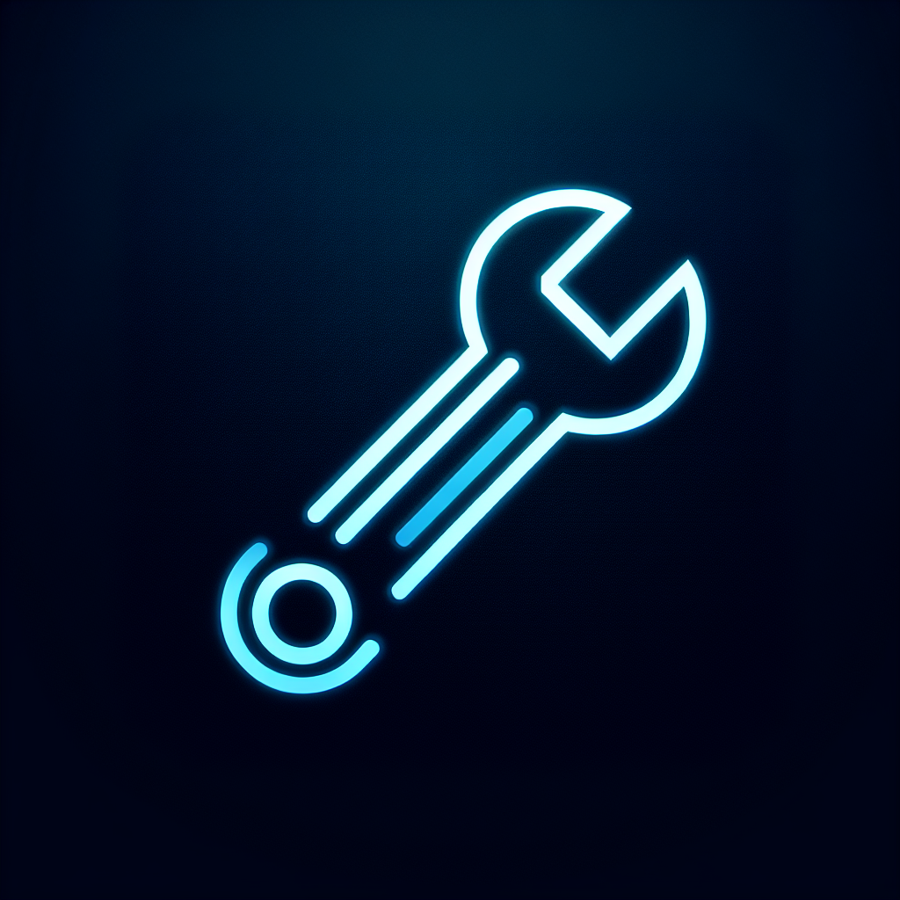

# QDOS Camera App

A React Native mobile application that provides an interactive and engaging media capture experience through advanced QR code scanning and dynamic Rive animation overlays.



## Features

- 📱 Advanced camera interface with QR code scanning
- 🎞️ Photo and video capture functionality
- 🔄 Dynamic Rive animations as camera overlays
- 📊 Local media storage and management
- ☁️ Secure media upload to backend servers
- 🐦 Twitter integration for social sharing
- 📋 QR code information retrieval and display
- 📱 Optimized for Android devices

## Prerequisites

- Node.js (v14 or higher)
- Java Development Kit (JDK 11 or higher)
- Android Studio and Android SDK
- React Native CLI

## Installation

1. Clone the repository:
   ```bash
   git clone https://github.com/yourusername/qdos-camera-app.git
   cd qdos-camera-app
   ```

2. Install dependencies:
   ```bash
   npm install
   ```

3. Set up environment variables:
   Create a `.env` file in the root directory with the following content:
   ```
   API_KEY=your_api_key_here
   API_URL=https://qdos-api.liquidiser.co.uk/api
   ```

4. Start Metro bundler:
   ```bash
   npx react-native start
   ```

5. Run the app on Android:
   ```bash
   npx react-native run-android
   ```

## Project Structure

The application follows a feature-based architecture:

```
/src
  /api           - API service modules
  /components    - Reusable UI components
  /context       - Global state management
  /hooks         - Custom React hooks
  /navigation    - Navigation configuration
  /screens       - Screen components
  /types         - TypeScript type definitions
  /utils         - Utility functions
```

For more detailed information, see [APP_STRUCTURE.md](APP_STRUCTURE.md).

## API Documentation

The app interacts with the QDOS backend API. For detailed API documentation, refer to [API_DOCUMENTATION.md](API_DOCUMENTATION.md).

## Building the App

### Quick Build Options

Several build scripts are available to simplify the build process:

1. **EAS Cloud Build** (Recommended):
   ```bash
   # Make script executable
   chmod +x eas-build.sh
   
   # Run EAS build with preview profile
   ./eas-build.sh preview
   ```

2. **Local Android Build**:
   ```bash
   # Make script executable
   chmod +x build-android.sh
   
   # Build debug APK
   ./build-android.sh debug
   
   # Or build release APK
   ./build-android.sh release
   ```

3. **External Build Preparation**:
   ```bash
   # Make script executable
   chmod +x prepare-build.sh
   
   # Prepare files for external building
   ./prepare-build.sh
   ```

For comprehensive build documentation, see [BUILDING_APK.md](BUILDING_APK.md).

## Usage Flow

1. **Launch the app** - The app opens to the home screen
2. **Scan QR Code** - Point camera at a QR code to scan
3. **View Overlay** - See Rive animation overlay on camera view
4. **Capture Media** - Take photos or record video with the overlay
5. **Preview & Edit** - Review captured media
6. **Upload & Share** - Upload to server and share to Twitter

## Key Components

- **Camera Interface** - Uses `react-native-vision-camera` for advanced camera features
- **QR Scanner** - Custom QR detection with real-time processing
- **Rive Animations** - Interactive animations using `rive-react-native`
- **Media Management** - Local storage using `react-native-fs`
- **Background Upload** - Efficient uploads with `react-native-background-upload`

## Troubleshooting

### Common Issues

- **Camera Permission Denied** - Go to device settings and enable camera permissions for the app
- **Storage Permission Denied** - Enable storage permissions in device settings
- **QR Code Not Scanning** - Ensure adequate lighting and QR code is clearly visible
- **Upload Failures** - Check network connection and API key configuration

### Debugging

For development and debugging:

1. Enable developer mode on your device
2. Connect via USB debugging
3. Use Chrome DevTools for remote debugging
4. Check Metro bundler logs for JavaScript errors
5. Review device logs for native-side issues

## Contributing

1. Fork the repository
2. Create a feature branch (`git checkout -b feature/amazing-feature`)
3. Commit your changes (`git commit -m 'Add some amazing feature'`)
4. Push to the branch (`git push origin feature/amazing-feature`)
5. Open a Pull Request

## License

This project is licensed under the MIT License - see the [LICENSE](LICENSE) file for details.

## Acknowledgements

- [React Native](https://reactnative.dev/)
- [Rive](https://rive.app/)
- [Vision Camera](https://mrousavy.com/react-native-vision-camera/)
- [React Navigation](https://reactnavigation.org/)

## Contact

For questions or support, please contact:
- Project Link: [https://github.com/yourusername/qdos-camera-app](https://github.com/yourusername/qdos-camera-app)